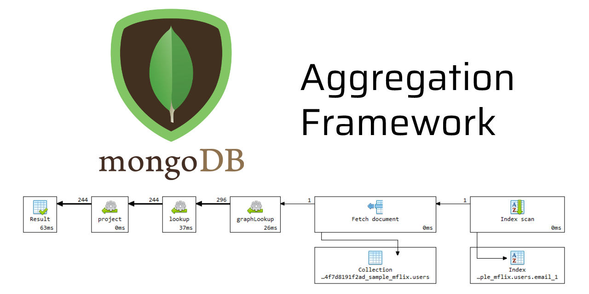

[[toc]]

## Introduction

- Data-oriented problem-solving rather than business process problem-solving.
- It is like functional programming approach
- An aggregation pipeline is an ordered series of statements, called stages.
- Where the entire output of one stage forms the entire input of the next stage, and so on, with no side effects.
- It has a low vulnerability to injection attacks, and it is highly composable.

## Sample Use cases

- Real-time dashboards
- Real-time analytics
- Copying and transforming subsets of data from one collection to another
- Joining data together from different collections on the "server-side"
- Report generation with roll-ups, sums & averages
