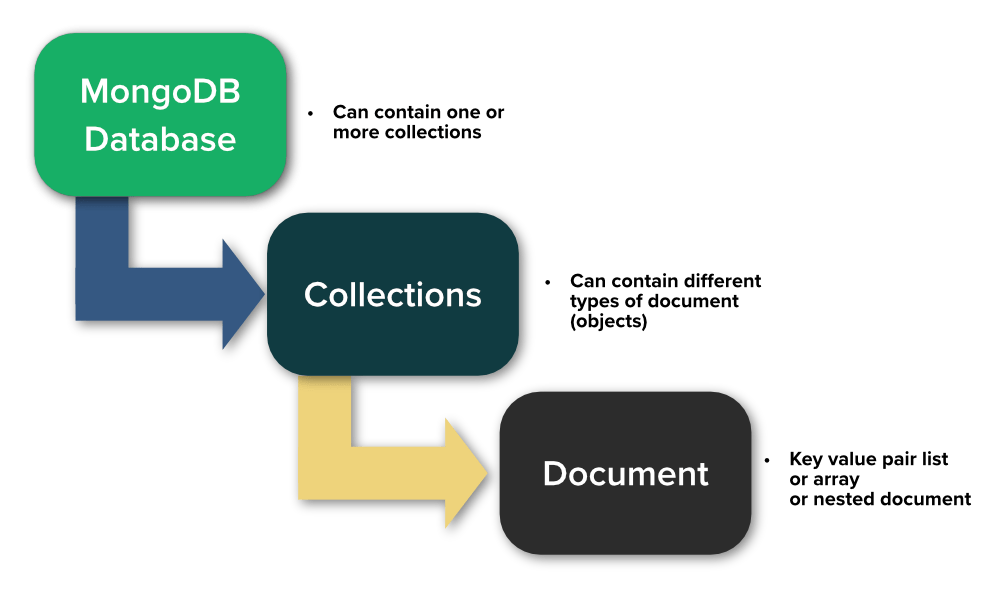

::: tip
Mongo Database Operation are seen below
:::

[[toc]]



## Create Database

- MongoDB **use DATABASE_NAME** is used to create database. The command will create a new database if it doesn't exist, otherwise it will return the existing database.

```shell
>  use <DB_NAME>
```

## Show Database

- To check db was created use

```shell
>  show <DB_NAME>
>  show databases;

```

- now **db.** always refers to currently selected DB.

## Drop Database

- to delete database we use

```shell
>  db.dropDatabase();
```
