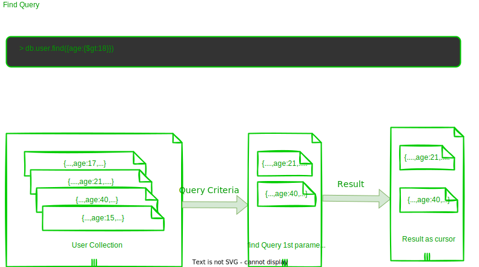
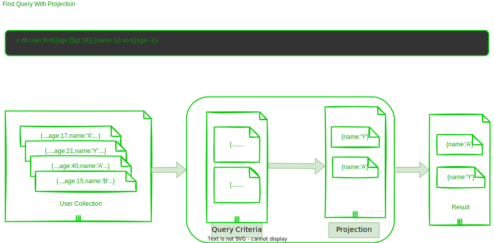
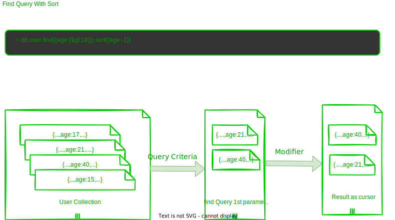
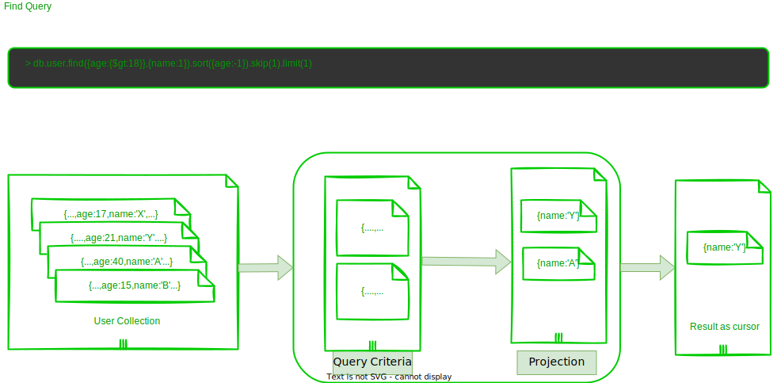

## find

- to query all data from collection
- to fetch single document from collection use **findOne()**
  
;

```shell
db.test5.find()
```


## projection




## cursor
-The Cursor is a MongoDB Collection of the document which is returned upon the find method execution.

- By default, it is automatically executed as a loop. However, we can explicitly get specific index document from being returned cursor. It is just like a pointer which is pointing upon a specific index value.

-In simple words when we call a find method, all the documents which are returned are saved in a virtual cursor. If a find method returns for a document then it is mean that the cursor has 0 – n index.


## sort




## limit & skip



## some mongo query operator

- $and
- $or
- $gt
- $gte
- $lte
- $lt
- $ne
- $nin
- $not
- $inc
- $all
- $elemMatch
- $size
