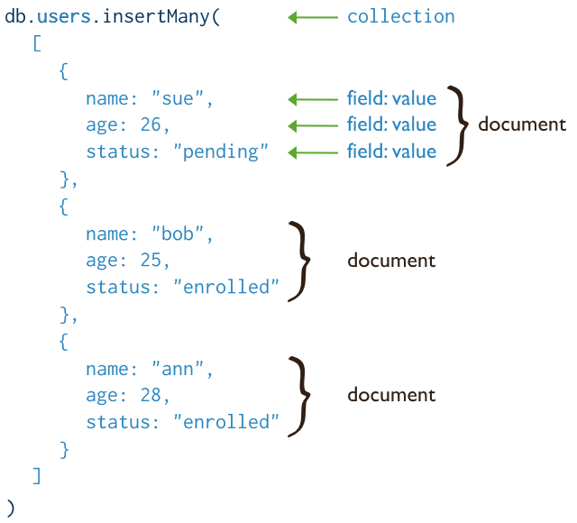
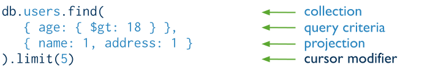

::: tip
Mongo Database Collection Operation are seen below
:::


## Insert/Create

### InsertOne


### InsertMany



::: details Try

```shell
db.test5.insertOne({testString:'HelloWorld'})
```

```shell
db.test5.insertMany([{testString:'HelloWorld'},{testStr:'H2'}])
```

:::

## Read/Find



::: tip
:microscope: **Cursor** - find method will return a [**pointer**](https://en.wikipedia.org/wiki/Pointer_(computer_programming)) which will points to the document of collection,this pointer is known as cursor
:::

::: details Try

```shell
db.test5.find()
```

:::

## Update/Modify

### updateMany


### updateOne

- for updateOne, first matched record from document get's updated

### replaceOne

- for replaceOne, find the first matching document and replace the entire document with new data supplied, whereas id is preserved

::: details Try

```shell
db.test5.updateOne({'id':4},{$set:{'name':'Sangeet'}})
```

```shell
db.test5.updateMany({'id':{$gt:3,$lt:5}},{$set:{'name':'Srinivasagaru'}})
```

```shell {3-21}
db.test5.replaceOne({
_id: ObjectId("62e810fb0a888652437cada5")},
{
    id: 4,
    name: 'OConner',
    username: 'Karianne',
    email: 'Julianne.OConner@kory.org',
    address: {
        street: 'Hoeger Mall',
        suite: 'Apt. 692',
        city: 'South Elvis',
        zipcode: '53919-4257',
        geo: { lat: '29.4572', lng: '-164.2990' }
    },
    phone: '493-170-9623 x156',
    website: 'kale.biz',
    company: {
        name: 'Robel-Corkery',
        catchPhrase: 'Multi-tiered zero tolerance productivity',
        bs: 'transition cutting-edge web services'
      }
});

```

:::

## Delete/Remove

### deleteMany


### deleteOne

- for deleteOne, first matched record from document get's deleted

::: details Try

```shell
db.test5.deleteOne({id:7})
```

```shell
db.test5.deleteMany({testString:'Hello World'})
```

:::
## bulkWrite

::: details try on VSCODE Playground

```js
const database = 'testimports';
const collection = 'testbulkwrite';

// The current database to use.
use(database);

// Create a new collection.
db.createCollection(collection);

db.getCollection(collection).insertMany( [
   { _id: 0, type: "pepperoni", size: "small", price: 4 },
   { _id: 1, type: "cheese", size: "medium", price: 7 },
   { _id: 2, type: "vegan", size: "large", price: 8 }
] )

db.getCollection(collection).bulkWrite( [
      { insertOne: { document: { _id: 3, type: "beef", size: "medium", price: 6 } } },
      { insertOne: { document: { _id: 4, type: "sausage", size: "large", price: 10 } } },
      { updateOne: {
         filter: { type: "cheese" },
         update: { $set: { price: 8 } }
      } },
      { deleteOne: { filter: { type: "pepperoni"} } },
      { replaceOne: {
         filter: { type: "vegan" },
         replacement: { type: "tofu", size: "small", price: 4 }
      } }
] );

db.getCollection(collection).find();

```

:::