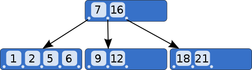

::: tip
Mongo Database Indexing  are seen below
:::

[[toc]]



## Importance of Indexing

- With the use of Indexes, performing queries in MongoDB becomes more efficient.
- MongoDB uses B-Tree searching algorithm for indexed value
- **Actually what happens if no index ?**
    - If you had a collection with thousands of documents with no indexes, and then you query to find certain documents,   then in such case MongoDB would need to scan the entire collection to find the documents.
- **Actually what happens if  indexed ?**
    - It would use these indexes to limit the number of documents that had to be searched in the collection.

## Downside of Indexing
- having too many indexes can slow down other operations such as the Insert, Delete and Update operation. 

## Create Index

- The createIndex method is used to create an index based on the field name present
- if positive number is present at creation of index sort them with ascending order
- if negative number is present at creation of index sort them with descending order
- mongodb by default create index having _id, which is object id
- we can have many fields name as index

```shell
>  db.<collection_name>.createIndex({id:1})
```

## Get Index

- to get indexes
  
```shell
>  db.<collection_name>.getIndexes()
```

## Delete Index

- To delete specific index

```shell
>  db.<collection_name>.dropIndex({id:1})
```

- To delete all indexes

```shell
>  db.<collection_name>.dropIndexes()
```


## Query Explain
- we can optimise the query by using **explain()** method
- it is important to view the explain plan for a query to determine if you've used the appropriate index and if you need to optimise other aspects of the query or the data model
- allows you to understand fully the performance implications of the query you have created
- 3 verbosity level available
    - queryPlanner 
      - default if no verbosity parameter provided
      - At this level, explain provides information about the winning plan, including the index used or if a collection scan is needed (COLLSCAN)
    - executionStats
      - queryPlanner + stats
      - stats include details such as the number of documents examined and returned, the execution time in milliseconds
    - allPlansExecution
      - executionStats + information about the discarded execution plans


```shell
>  db.<collection_name>.find().explain()
```
- **queryPlanner.winningPlan.stage = "COLLSCAN"**
  - needs to do a collection scan
  - query is not optimized because all the documents must be read
- **executionStats.nReturned = some_number**
  - number of documents returned is some_number
- **executionStats.totalDocsExamined = some_number**
  - assume on colscan we have scanned 3772 documents
  - documents examined is exactly the number of documents in the collection (@COLLSCAN we can expect this)
- **executionStats.executionTimeMillis = some_number**
  - some_number refers to tell how many millisecond it took to return the response
- **queryPlanner.winningPlan.inputStage.stage = "IXSCAN"**
  - IXSCAN means that now MongoDB doesn't need to do a collection scan but an index can be used to find the documents.
- **queryPlanner.winningPlan.inputStage.indexName = indexed_field**
  - indexed_field will be the name of the index used
- **queryPlanner.winningPlan.inputStage.direction = "forward"**
- **executionStats.totalDocsExamined = some_number**
  - assume on colscan we have scanned 1800 documents only because of indexing
- **executionStats.totalKeysExamined = some_number**
  - number of keys examined in the index