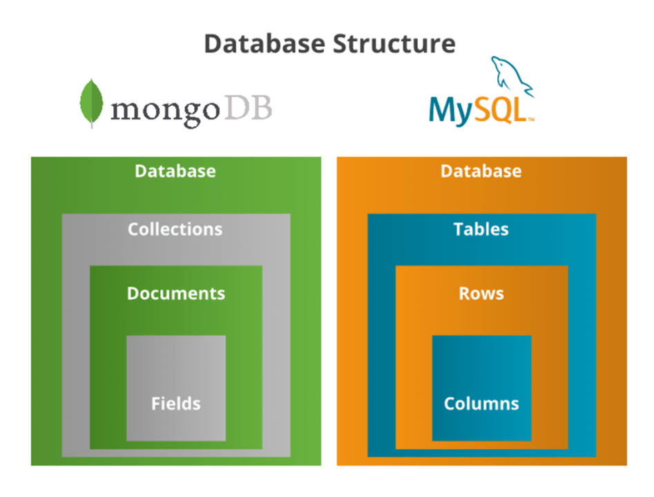

## Why MongoDB ?

> - NoSQL database
> - Dynamic Schema so no predefined Schema
> - Example for Non-Relational Database
> - Follows JSON Structure.
> - Follows Key value pair.

## Comparison for MySql vs MongoDB?

| MySQL                                                                           |                                       MongoDB                                        |
| ------------------------------------------------------------------------------- | :----------------------------------------------------------------------------------: |
| Relational database                                                             |                               Non relational database                                |
| Data is stored in table                                                         |                            Data is stored in a collection                            |
| Each table consist of row/record                                                |                 Document can have as many as field as user required                  |
| It has static or predefined schema                                              |                                It has dynamic schema                                 |
| It follow **ACID** properties (Atomicity,Consistencey,Isolation and Durability) | It follows Brewer **Cap Theorem** (Consistency,Availability and Partition tolerance) |
| Tables                                                                          |                                     collections                                      |
| Rows                                                                            |                                      documents                                       |
| Column                                                                          |                                  Fields/key=>value                                   |

## Pictorial Comparision

